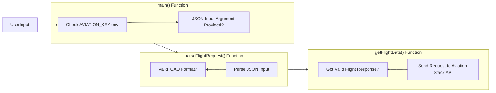

# Flight Information Fetcher

This simple Go application fetches and displays flight information based on the ICAO (International Civil Aviation Organization) flight number. It utilizes the Aviation Stack API to get the flight data.

## Features

- **ICAO Validation**: Ensures that the inputted ICAO code adheres to the format - 2 to 4 letters followed by 1 to 4 numbers.
- **Error Handling**: Detailed error messages for better understanding.
- **Environment Variables**: Uses environment variable for the Aviation Stack API key.

## Prerequisites

- Go (v1.15 or newer recommended).
- An API key from [Aviation Stack](https://aviationstack.com/).

## Setup

1. Clone this repository:
   ```bash
   git clone <repository-url>
   cd <repository-dir>
   ```

2. Set up the API key environment variable:
   ```bash
   export AVIATION_KEY=your_api_key_here
   ```

3. Run the program:
   ```bash
   go run main.go '{"icao":"YOUR_ICAO"}'
   ```

Replace `YOUR_ICAO` with the desired ICAO number.

You can do steps 2 and 3 in one command:
    ```bash
    export AVIATION_KEY=your_api_key_here && go run main.go '{"icao":"YOUR_ICAO"}'
    ```

## Code Structure

- **Structs**:
  - `FlightRequest`: Represents the incoming JSON request containing the ICAO number.
  - `Flight`: Contains flight details including departure, arrival, and airline information.
  - `Location`: Details of the airport (departure/arrival).
  - `Airline`: Contains the airline name.
  - `FlightResponse`: The structure of the API response from Aviation Stack.

- **Functions**:
  - `main()`: Entry point.
  - `parseFlightRequest()`: Validates and parses the input JSON to a `FlightRequest`.
  - `getFlightData()`: Fetches flight data from Aviation Stack.

## Application Flowchart

The following is a flowchart representing the primary functions and flow of the application:



## Running the Tests

To run the tests, navigate to the directory containing the Go source files and execute the following command:

```bash
go test
```

This will run all the tests in the package and provide a summary of passed and failed tests. If you want more verbose output, you can use:

```bash
go test -v
```

## Contribution

Feel free to fork, modify, and submit pull requests. If you encounter issues, please open a new issue detailing the problem.

## License

Please ensure you have the necessary permissions to use data fetched from the Aviation Stack API. This software is provided "as is", without any warranties.